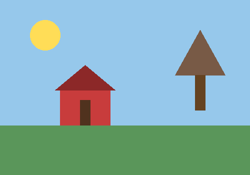

# collagify

Tile every image in a folder into a single side-by-side collage.

## Motivation

I wanted a quick way to spot minute changes or differences between 2+ images. Placing them right next to each other makes small visual differences jump out immediately. I didn't feel comfortable uploading my pictures to random online image comparison tools just to get this, so I built a small local CLI that does it instead. Everything runs on your own machine and you own your data :)

## Example

Input images in [images/](images/):

| `scene_v1.png` | `scene_v2.png` |
| --- | --- |
|  |  |

Running collagify produces [output/readme-collage.png](output/readme-collage.png), which places them side by side so the difference is obvious at a glance:


## Installation

Requires [uv](https://docs.astral.sh/uv/).

```bash
uv sync
```

## Usage

```bash
uv run main.py --input-dir images --output output/collage.png
```

| Option | Short | Default | Description |
| --- | --- | --- | --- |
| `--input-dir` | `-i` | `images` | Folder containing source images |
| `--output` | `-o` | `output/collage.png` | Path to write the collage to |
| `--height` | `-h` | `400` | Height (px) each image is scaled to |
| `--spacing` | `-s` | `10` | Gap (px) between images |
| `--background` | `-b` | `white` | Background color (name or hex) |

Images are read in filename order, resized to a common height (preserving aspect ratio, no cropping or flipping), and placed left to right. Landscape and portrait images can be mixed freely. EXIF orientation is respected.